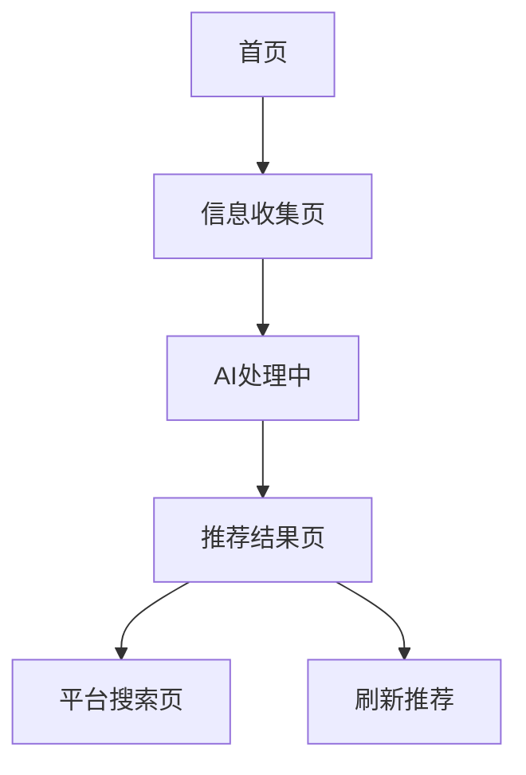

## 1. 产品概述

温馨可爱的礼物推荐网页应用，通过AI技术为用户提供个性化、创意性的礼物推荐服务。解决用户在选择礼物时的困扰，帮助用户找到独特而有意义的礼物选择。

目标用户：需要为他人准备礼物的消费者，特别是追求个性化和创意礼物的年轻用户群体。

## 2. 核心功能

### 2.1 用户角色

| 角色   | 注册方式 | 核心权限         |
| ---- | ---- | ------------ |
| 访客用户 | 无需注册 | 使用基础推荐功能     |
| 注册用户 | 邮箱注册 | 保存推荐历史、个性化设置 |

### 2.2 功能模块

温馨礼物推荐应用包含以下核心页面：

1. **首页**：欢迎界面、步骤指示器、开始推荐按钮
2. **信息收集页**：用户信息表单（性别、年龄、爱好、预算）
3. **推荐结果页**：个性化礼物卡片展示、平台跳转链接

### 2.3 页面详情

| 页面名称  | 模块名称  | 功能描述             |
| ----- | ----- | ---------------- |
| 首页    | 欢迎区域  | 显示温馨欢迎语和应用介绍     |
| 首页    | 步骤指示器 | 显示当前进度（1/3步骤）    |
| 首页    | 开始按钮  | 点击进入信息收集页面       |
| 信息收集页 | 性别选择  | 单选按钮选择用户性别       |
| 信息收集页 | 年龄滑块  | 拖拽滑块选择年龄范围       |
| 信息收集页 | 爱好标签云 | 多选标签展示，支持自定义输入   |
| 信息收集页 | 预算滑块  | 双滑块选择预算区间        |
| 信息收集页 | 提交按钮  | 验证表单完整性后提交       |
| 推荐结果页 | 加载动画  | AI处理期间显示友好等待提示   |
| 推荐结果页 | 礼物卡片  | 展示商品名称、推荐理由、价格区间 |
| 推荐结果页 | 平台链接  | 生成淘宝、京东、拼多多搜索链接  |
| 推荐结果页 | 刷新按钮  | 一键刷新推荐结果         |

## 3. 核心流程

用户操作流程：

1. 用户访问首页，点击开始推荐
2. 填写个人信息（性别、年龄、爱好、预算）
3. 提交信息后显示加载动画
4. AI生成个性化推荐结果
5. 展示礼物卡片列表，支持平台跳转

## 4. 用户界面设计

### 4.1 设计风格

* **主色调**：温暖粉色（#FFB6C1）和米白色（#FFF8F3）

* **辅助色**：薄荷绿（#98FB98）和淡紫色（#DDA0DD）

* **按钮样式**：圆润大按钮，带轻微阴影效果

* **字体**：圆润无衬线字体，标题18-24px，正文14-16px

* **布局风格**：卡片式布局，大量圆角元素

* **图标风格**：圆润线条图标，使用emoji增强亲和力

### 4.2 页面设计概述

| 页面名称  | 模块名称 | UI元素                |
| ----- | ---- | ------------------- |
| 首页    | 欢迎区域 | 中心对齐，温暖渐变背景，圆润标题文字  |
| 信息收集页 | 表单区域 | 卡片式分组，柔和阴影，大圆角输入框   |
| 信息收集页 | 滑块组件 | 粉色滑块轨道，圆形滑块按钮       |
| 信息收集页 | 标签云  | 圆角标签，选中状态变色，添加动画效果  |
| 推荐结果页 | 礼物卡片 | 白色卡片，粉色边框，阴影效果，悬停动画 |
| 推荐结果页 | 平台按钮 | 彩色平台图标，圆角矩形按钮       |

### 4.3 响应式设计

* **桌面优先**：优先适配桌面端，最大宽度1200px

* **移动端适配**：支持手机和平板，触摸优化

* **断点设置**：768px（平板）、480px（手机）

* **触摸优化**：增大点击区域，支持滑动手势

