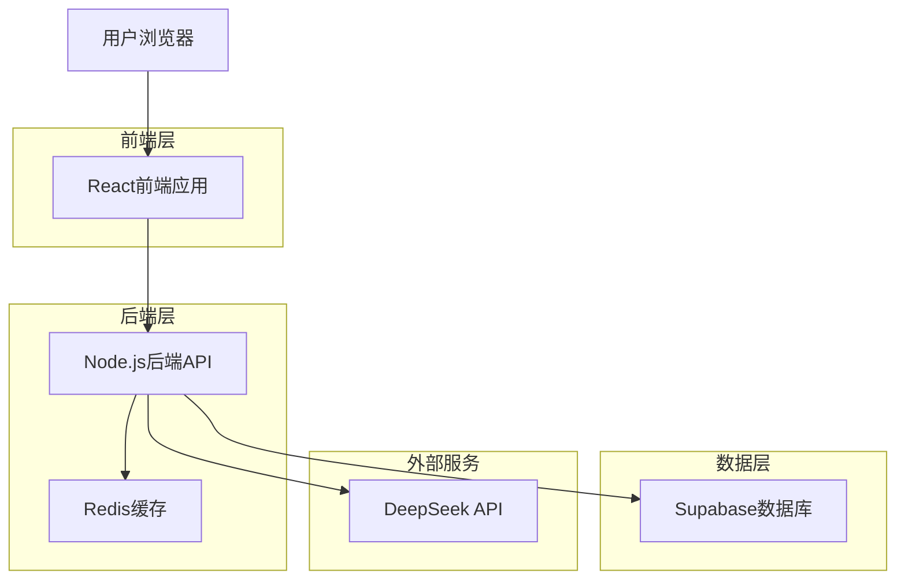
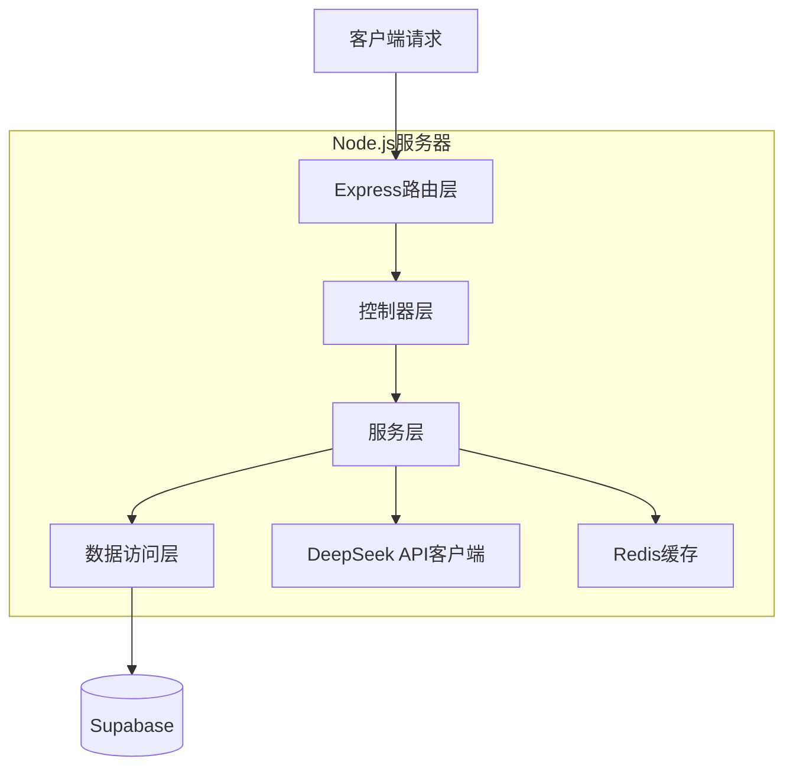
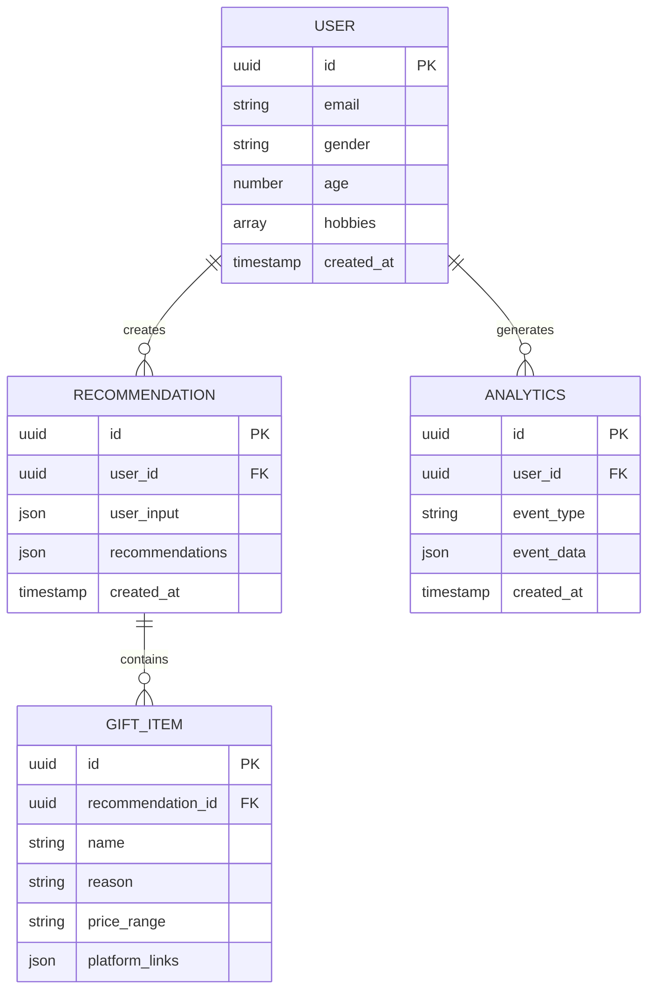

## 1. 架构设计



## 2. 技术描述

- **前端**：React@18 + TypeScript + Tailwind CSS@3 + Vite
- **初始化工具**：vite-init
- **后端**：Node.js@24.14.0 + Express@4
- **数据库**：Supabase (PostgreSQL)
- **缓存**：Redis
- **AI服务**：DeepSeek API

## 3. 路由定义

| 路由 | 用途 |
|------|------|
| / | 首页，欢迎界面 |
| /form | 信息收集表单页面 |
| /recommendations | 推荐结果展示页面 |
| /api/recommendations | 获取AI推荐结果的API端点 |
| /api/analytics | 用户行为追踪API |

## 4. API定义

### 4.1 推荐API

```
POST /api/recommendations
```

请求参数：
| 参数名 | 参数类型 | 是否必需 | 描述 |
|--------|----------|----------|------|
| gender | string | true | 用户性别（male/female/other） |
| age | number | true | 用户年龄（1-100） |
| hobbies | array | true | 爱好标签数组 |
| budgetMin | number | true | 预算下限（元） |
| budgetMax | number | true | 预算上限（元） |

响应参数：
| 参数名 | 参数类型 | 描述 |
|--------|----------|------|
| success | boolean | 请求状态 |
| data | array | 推荐商品列表 |
| message | string | 错误信息（如有） |

请求示例：
```json
{
  "gender": "female",
  "age": 25,
  "hobbies": ["摄影", "手工", "阅读"],
  "budgetMin": 100,
  "budgetMax": 500
}
```

响应示例：
```json
{
  "success": true,
  "data": [
    {
      "name": "复古胶片相机",
      "reason": "适合记录生活美好瞬间，胶片质感独特",
      "priceRange": "200-400元",
      "platforms": {
        "taobao": "https://s.taobao.com/search?q=复古胶片相机",
        "jd": "https://search.jd.com/Search?keyword=复古胶片相机",
        "pdd": "https://mobile.yangkeduo.com/search_result.html?search_key=复古胶片相机"
      }
    }
  ]
}
```

## 5. 服务器架构图



## 6. 数据模型

### 6.1 数据模型定义



### 6.2 数据定义语言

用户表（users）
```sql
-- 创建用户表
CREATE TABLE users (
  id UUID PRIMARY KEY DEFAULT gen_random_uuid(),
  email VARCHAR(255) UNIQUE,
  gender VARCHAR(20),
  age INTEGER,
  hobbies JSONB,
  created_at TIMESTAMP WITH TIME ZONE DEFAULT NOW()
);

-- 创建推荐记录表
CREATE TABLE recommendations (
  id UUID PRIMARY KEY DEFAULT gen_random_uuid(),
  user_id UUID REFERENCES users(id),
  user_input JSONB NOT NULL,
  recommendations JSONB NOT NULL,
  created_at TIMESTAMP WITH TIME ZONE DEFAULT NOW()
);

-- 创建用户行为分析表
CREATE TABLE analytics (
  id UUID PRIMARY KEY DEFAULT gen_random_uuid(),
  user_id UUID REFERENCES users(id),
  event_type VARCHAR(50) NOT NULL,
  event_data JSONB,
  created_at TIMESTAMP WITH TIME ZONE DEFAULT NOW()
);

-- 创建索引
CREATE INDEX idx_users_email ON users(email);
CREATE INDEX idx_recommendations_user_id ON recommendations(user_id);
CREATE INDEX idx_recommendations_created_at ON recommendations(created_at DESC);
CREATE INDEX idx_analytics_user_id ON analytics(user_id);
CREATE INDEX idx_analytics_event_type ON analytics(event_type);

-- 设置权限
GRANT SELECT ON users TO anon;
GRANT ALL PRIVILEGES ON users TO authenticated;
GRANT SELECT ON recommendations TO anon;
GRANT ALL PRIVILEGES ON recommendations TO authenticated;
GRANT SELECT ON analytics TO anon;
GRANT ALL PRIVILEGES ON analytics TO authenticated;
```